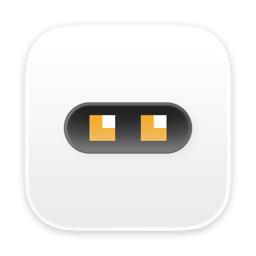
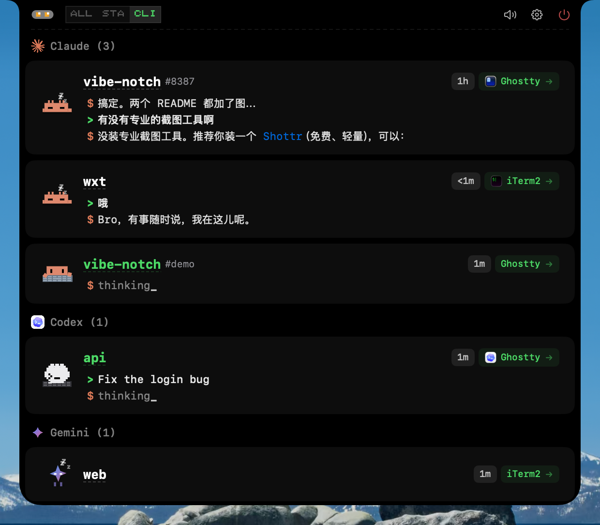
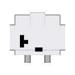
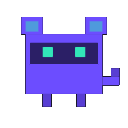

<h1 align="center">
  &nbsp;
  CodeIsland
</h1>
<p align="center">
  <b>macOS 灵动岛（刘海）实时 AI 编码 Agent 状态面板</b><br>
  <a href="#安装">安装</a> •
  <a href="#功能特性">功能</a> •
  <a href="#支持的工具">支持的工具</a> •
  <a href="#从源码构建">构建</a><br>
  <a href="README.md">English</a> | 简体中文
</p>

---

<p align="center">
  
</p>

## CodeIsland 是什么？

CodeIsland 住在你 MacBook 的刘海区域，实时展示 AI 编码 Agent 的工作状态。不用再频繁切窗口去看 Claude 是否在等审批、Codex 是否完成了任务。

它通过 Unix socket IPC 连接 **9 种 AI 编码工具**，在刘海面板中展示会话状态、工具调用、权限请求等信息——全部呈现在一个紧凑的像素风面板中。

## 功能特性

- **刘海原生 UI** — 从 MacBook 刘海处展开，空闲时自动收起
- **支持 9 种 AI 工具** — Claude Code、Codex、Gemini CLI、Cursor、Copilot、Qoder、Factory、CodeBuddy、OpenCode
- **实时状态追踪** — 查看活跃会话、工具调用和 AI 回复
- **权限管理** — 直接在面板上审批/拒绝工具权限请求
- **问题回答** — 无需离开当前应用即可回答 Agent 的问题
- **像素风角色** — 每个 AI 工具都有专属的像素动画角色
- **一键跳转** — 点击会话直接跳转到对应的终端标签页或 IDE 窗口
- **智能通知抑制** — 标签页级终端检测：只在你正在看该会话的标签页时抑制通知，而不是整个终端应用
- **音效提示** — 可选的 8-bit 风格音效通知
- **自动安装 Hook** — 自动为所有检测到的 CLI 工具配置 hooks，支持自动修复和版本追踪
- **中英双语** — 支持中文和英文，自动跟随系统语言
- **多显示器** — 支持外接显示器，自动检测刘海屏幕

## 支持的工具

| | 工具 | 事件 | 跳转 | 状态 |
|:---:|------|------|------|------|
|  |  Claude Code | 13 | 终端标签页 | 完整 |
|  |  Codex | 3 | 终端 | 基础 |
|  |  Gemini CLI | 6 | 终端 | 完整 |
|  |  Cursor | 10 | IDE | 完整 |
|  |  Copilot | 6 | 终端 | 完整 |
|  |  Qoder | 10 | IDE | 完整 |
|  |  Factory | 10 | IDE | 完整 |
|  |  CodeBuddy | 10 | APP/终端 | 完整 |
|  |  OpenCode | All | APP/终端 | 完整 |

## 安装

### Homebrew（推荐）

```bash
brew tap wxtsky/tap
brew install --cask codeisland
```

### 手动下载

1. 前往 [Releases](https://github.com/wxtsky/CodeIsland/releases) 页面
2. 下载 `CodeIsland.dmg`
3. 打开 DMG，将 `CodeIsland.app` 拖入「应用程序」文件夹
4. 启动 CodeIsland — 会自动为所有检测到的 AI 工具安装 hooks

> **提示：** 首次启动时 macOS 可能弹出安全提示，前往 **系统设置 → 隐私与安全性** 点击 **仍要打开** 即可。

### 从源码构建

需要 **macOS 14+** 和 **Swift 5.9+**。

```bash
git clone https://github.com/wxtsky/CodeIsland.git
cd CodeIsland

# 开发模式（debug 构建 + 启动）
swift build && open .build/debug/CodeIsland.app

# 发布模式（通用二进制：Apple Silicon + Intel）
./build.sh
open .build/release/CodeIsland.app
```

## 工作原理

```
AI 工具 (Claude/Codex/Gemini/Cursor/...)
  → 触发 Hook 事件
    → codeisland-bridge（原生 Swift 二进制，约 86KB）
      → Unix socket → /tmp/codeisland-<uid>.sock
        → CodeIsland 接收事件
          → 实时更新 UI
```

CodeIsland 在每个 AI 工具的配置中安装轻量级 hooks。当工具触发事件（会话开始、工具调用、权限请求等）时，hook 通过 Unix socket 发送 JSON 消息。CodeIsland 监听此 socket 并即时更新刘海面板。

**OpenCode** 使用 JS 插件直接连接 socket，无需 bridge 二进制。

## 设置

CodeIsland 提供 7 个标签页的设置面板：

- **通用** — 语言、登录时启动、显示器选择
- **行为** — 自动隐藏、智能抑制、会话清理
- **外观** — 面板高度、字体大小、AI 回复行数
- **角色** — 预览所有像素风角色及动画
- **声音** — 8-bit 风格音效通知
- **Hooks** — 查看 CLI 安装状态、重新安装或卸载 hooks
- **关于** — 版本信息和链接

## 系统要求

- macOS 14.0（Sonoma）或更高版本
- 在带刘海的 MacBook 上效果最佳，也支持外接显示器

## 致谢

本项目受 [@farouqaldori](https://github.com/farouqaldori) 的 [claude-island](https://github.com/farouqaldori/claude-island) 启发，感谢提供了将 AI Agent 状态带入 macOS 刘海的创意。

## Star History

<a href="https://www.star-history.com/?repos=wxtsky%2FCodeIsland&type=date&legend=bottom-right">
 <picture>
   <source media="(prefers-color-scheme: dark)" srcset="https://api.star-history.com/chart?repos=wxtsky/CodeIsland&type=date&theme=dark&legend=top-left" />
   <source media="(prefers-color-scheme: light)" srcset="https://api.star-history.com/chart?repos=wxtsky/CodeIsland&type=date&legend=top-left" />
   
 </picture>
</a>

## 许可证

MIT 许可证 — 详见 [LICENSE](LICENSE)。
